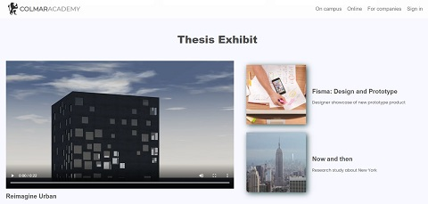

# Colmar Academy

This project was part of Codecademy's Build a Website path. It involved creating a responsive landing page for Colmar Academy using HTML, CSS, and GitHub Pages. We used provided wireframes, videos, and images, while making additional design decisions. Media queries ensured the site was optimized for both desktop and mobile.

## Table of Contents

- [Technologies](#technologies)
- [Screenshots](#screenshots)
- [Status](#status)

## Technologies

This project was created with:

- HTML5
- CSS3

## Screenshots

## Status

This project has been completed.# capstoneproject
